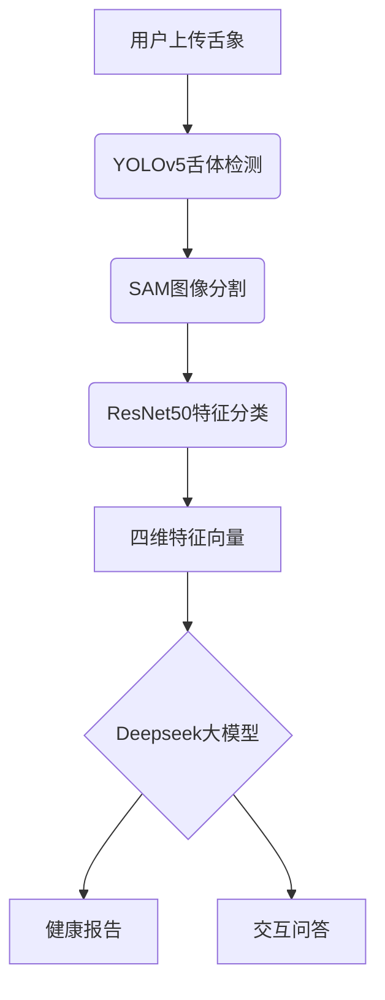

# 舌诊宝：中医舌象诊断AI助手 🩺🤖

[](https://opensource.org/licenses/MIT)
[](https://www.python.org/)
[](https://docs.conda.io/)

> 基于深度学习的多模态舌象分析系统，融合目标检测、图像分割与语言大模型，提供智能化中医舌诊服务。

---

## 📌 核心功能

### 1.0 版本核心
- **四维舌象分析**  
  通过多模型协同工作，精准识别舌色、舌苔色、薄厚、腻否四大关键指标
- **全流程自动化处理**  
  `YOLOv5` 舌体定位 → `Segment Anything` 高精度分割 → `ResNet50` 特征分类
- **跨平台Web应用**  
  支持浏览器直接访问，适配Windows/macOS/Linux系统

### 2.0 版本升级 ✨
- **智能问诊引擎**  
  集成深度求索 `Deepseek-r1-14B` 语言大模型，支持：
  - 基于舌象特征的多维度健康评估
  - 自然语言交互式健康咨询
  - 语音输入输出（需Chrome内核浏览器）

---

## 🚀 快速开始

### 环境要求
- Conda ≥23.10.0
- Python 3.9.21
- SQLite 3.35+
- \- 选择以下任一种大模型配置：

   \- 方案A：本地部署 (需 RAM ≥32GB)

   \- 方案B：云端API (推荐低配置设备使用)

  ### 大模型配置
  #### 方案A：本地部署（适用高配置设备）
  > 注意：项目使用 Deepseek-r1-14B 模型进行诊断分析，需要完成以下配置

  #### 1. 安装 Ollama
  ```bash
  # Windows 安装
  # 1. 下载 Ollama 安装包
  curl -L https://ollama.ai/download/ollama-windows-amd64.zip -o ollama-windows-amd64.zip
  
  # 2. 解压并安装
  Expand-Archive -Path ollama-windows-amd64.zip -DestinationPath C:\ollama
  ```

  #### 2. 下载模型
  ```bash
  # 启动 Ollama 服务
  cd C:\ollama
  .\ollama.exe serve
  
  # 新开终端，拉取模型
  .\ollama.exe pull deepseek-coder:14b
  ```

  #### 3. 验证配置
  ```bash
  # 测试模型是否正常加载
  .\ollama.exe run deepseek-coder:14b "你好"
  
  # 检查服务是否在正确端口运行
  curl http://localhost:11434/api/tags
  ```

  #### 常见问题
  1. **端口冲突**：确保 11434 端口未被占用
  ```bash
  # 检查端口占用
  netstat -ano | findstr :11434
  ```
  ### 大模型配置

  #### 方案B：云端API
  > 注意：通过 DeepSeek API 可以在低配置设备上使用大模型功能

  1. **注册 DeepSeek API**
     - 访问 [DeepSeek 开发者平台](https://www.deepseek.com/)
     - 注册账号并创建 API Key
     - 保存获取到的 API Key

  2. **安装依赖**
  ```bash
  pip install openai  # 使用 OpenAI SDK 调用 DeepSeek API
  ```

  3. **配置环境变量**
  ```bash
  # Windows CMD
  set DEEPSEEK_API_KEY=你的API密钥
  set DEEPSEEK_API_BASE=https://api.deepseek.com
  
  # Windows PowerShell
  $env:DEEPSEEK_API_KEY="你的API密钥"
  $env:DEEPSEEK_API_BASE="https://api.deepseek.com"
  ```

  4. **创建配置文件**
  ```python
  # filepath: application/config/api_config.py
  from openai import OpenAI
  import os
  
  class APIConfig:
      API_KEY = os.getenv('DEEPSEEK_API_KEY')
      BASE_URL = os.getenv('DEEPSEEK_API_BASE', 'https://api.deepseek.com')
      MODEL = "deepseek-chat"  # 使用最新的 DeepSeek-V3 模型
      
      @classmethod
      def get_client(cls):
          return OpenAI(
              api_key=cls.API_KEY,
              base_url=cls.BASE_URL
          )
  ```

  5. **验证配置**
  创建测试脚本：
  ```python
  # filepath: application/tests/test_api.py
  from config.api_config import APIConfig
  
  def test_api():
      try:
          client = APIConfig.get_client()
          response = client.chat.completions.create(
              model=APIConfig.MODEL,
              messages=[
                  {"role": "system", "content": "你是一个中医舌诊助手"},
                  {"role": "user", "content": "你好"}
              ],
              stream=False
          )
          print("✅ API测试成功！")
          print(f"响应内容: {response.choices[0].message.content}")
          return True
      except Exception as e:
          print(f"❌ API测试失败: {str(e)}")
          return False
  
  if __name__ == "__main__":
      test_api()
  ```

  6. **运行测试**
  ```bash
  # 在项目根目录下运行
  python application/tests/test_api.py
  ```

  7. **常见问题**
  - API 调用失败：
    - 检查 API Key 是否正确设置
    - 确认网络连接是否正常
    - 验证环境变量是否生效
  - 配额超限：
    - 登录开发者平台查看 API 使用配额
    - 考虑升级 API 套餐
  - 响应超时：
    - 检查网络连接
    - 尝试使用代理或 VPN
    - 适当增加超时时间设置

### 后端部署
```bash
# 克隆仓库
git clone https://github.com/your-repo/TongueDiagnosis.git
cd TongueDiagnosis/application

# 安装依赖
conda create -n tongueai python=3.9.21
conda activate tongueai
pip install -r requirements.txt

# 数据库初始化
sqlite3 AppDatabase.db < models/create_ChatRecord.sql  # 自动创建4张数据表
sqlite3 AppDatabase.db < models/create_Session.sql  # 自动创建4张数据表
sqlite3 AppDatabase.db < models/create_TongueAnalysis.sql  # 自动创建4张数据表
sqlite3 AppDatabase.db < models/create_User.sql  # 自动创建4张数据表

# 模型权重配置
wget -P ./net/weights/ \
  https://github.com/TonguePicture-SKaRD/TongueDiagnosis/releases/download/V1.0_Beta/{resnet50,yolov5}.pth \
  https://dl.fbaipublicfiles.com/segment_anything/sam_vit_b_01ec64.pth

# 启动服务
python ../run.py
```

### 前端启动
#### 方式一：预编译版本
```bash
npm run build
./frontend/tongue_diagnosis.exe  # Windows
```

#### 方式二：源码启动
##### 检查在 ./public 目录是否存在一个叫tongue 的文件夹，如果不存在，需要用户手动新建这个空文件夹。
```bash
cd frontend
npm install
npm run build
# Electron桌面端
npm run electron:start

# Web浏览器端（推荐Chrome）
npm run dev
```

---

## 🧩 项目架构

### 系统流程图
在做所有操作之前，必须先在左上角先写一个标题，用于开启这次对话。


### 目录结构
```
TongueDiagnosis/
├── application/          # 后端核心
│   ├── config/           - 服务配置
│   ├── core/             - 算法实现
│   │   ├── detection.py  -- YOLOv5舌体定位
│   │   ├── segmentation.py -- SAM图像分割
│   │   └── analysis.py   -- ResNet50分类模型
│   ├── net/weights/      - 模型权重文件
│   └── routes/           - API路由
├── frontend/             # 前端工程
│   ├── src/              - Vue3源码
│   │   ├── views/        -- 页面组件
│   │   └── services/     -- API服务层
│   └── electron/         - 桌面端封装
└── docs/                 # 文档资源
```