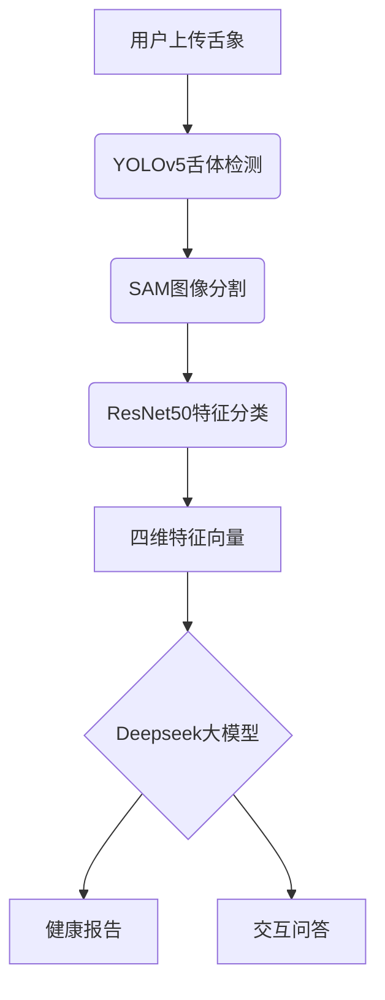

# 舌诊宝：中医舌象诊断AI助手 🩺🤖

> ⚠️ **项目声明**：本项目基于 [TonguePicture-SKaRD/TongueDiagnosis](https://github.com/TonguePicture-SKaRD/TongueDiagnosis) 进行开发和改进。
> 
> **主要改进**：
> - 替换本地部署的 Ollama 模型为云端百炼 API
> - 优化图像处理流程
> - 增加体质辨识功能
> - 改进错误处理机制
> 
> 感谢原项目作者的开源贡献,助我完成了一个课程设计！！！

[](https://opensource.org/licenses/MIT)
[](https://www.python.org/)
[](https://docs.conda.io/)

> 基于深度学习的多模态舌象分析系统，融合目标检测、图像分割与语言大模型，提供智能化中医舌诊服务。

---

## 📌 核心功能

### 1.0 版本核心
- **四维舌象分析**  
  通过多模型协同工作，精准识别舌色、舌苔色、薄厚、腻否四大关键指标
- **全流程自动化处理**  
  `YOLOv5` 舌体定位 → `Segment Anything` 高精度分割 → `ResNet50` 特征分类
- **跨平台Web应用**  
  支持浏览器直接访问，适配Windows/macOS/Linux系统

### 2.0 版本升级 ✨
- **智能问诊引擎**  
  集成深度求索 `Deepseek-r1-14B` 语言大模型，支持：
  - 基于舌象特征的多维度健康评估
  - 自然语言交互式健康咨询
  - 语音输入输出（需Chrome内核浏览器）

---

## 🚀 快速开始
```bash
  # 进入虚拟环境 tonugueai
  conda activate tongueai
  # 设置apikey环境变量 cmd
  set DASHSCOPE_API_KEY=sk-10c0353a5c254fda927647a6c714ac2a
  # 测试api 在项目根目录下运行
  python -m application.tests.test_api
  # 后端启动
  python run.py
  # 前端启动
  cd frontend
  npm run build
  # Electron桌面端
  npm run electron:start
  # Web浏览器端（推荐Chrome）
  npm run dev
  ```

   
### 环境要求
- Conda ≥23.10.0
- Python 3.9.21
- SQLite 3.35+
- \- 选择以下任一种大模型配置：

   \- 方案A：本地部署 (需 RAM ≥32GB)

   \- 方案B：云端API (推荐低配置设备使用)

  ### 大模型配置
  #### 方案A：本地部署（适用高配置设备）
  > 注意：项目使用 Deepseek-r1-14B 模型进行诊断分析，需要完成以下配置

  #### 1. 安装 Ollama
  ```bash
  # Windows 安装
  # 1. 下载 Ollama 安装包
  curl -L https://ollama.ai/download/ollama-windows-amd64.zip -o ollama-windows-amd64.zip
  
  # 2. 解压并安装
  Expand-Archive -Path ollama-windows-amd64.zip -DestinationPath C:\ollama
  ```

  #### 2. 下载模型
  ```bash
  # 启动 Ollama 服务
  cd C:\ollama
  .\ollama.exe serve
  
  # 新开终端，拉取模型
  .\ollama.exe pull deepseek-coder:14b
  ```

  #### 3. 验证配置
  ```bash
  # 测试模型是否正常加载
  .\ollama.exe run deepseek-coder:14b "你好"
  
  # 检查服务是否在正确端口运行
  curl http://localhost:11434/api/tags
  ```

  #### 常见问题
  1. **端口冲突**：确保 11434 端口未被占用
  ```bash
  # 检查端口占用
  netstat -ano | findstr :11434
  ```
  ### 大模型配置

  #### 方案B：云端API
  > 注意：通过百炼 API 可以在低配置设备上使用大模型功能

1. **注册百炼 API**
   - 访问 [百炼开发者平台](https://dashscope.aliyun.com/)
   - 注册账号并创建 API Key
   - 保存获取到的 API Key

2. **安装依赖**
```bash
pip install openai  # 使用 OpenAI SDK 调用百炼 API
```

3. **配置环境变量**
```bash
# Windows CMD
set DASHSCOPE_API_KEY=sk-10c0353a5c254fda927647a6c714ac2a

# Windows PowerShell
$env:DASHSCOPE_API_KEY="你的API密钥"
```

5. **运行测试**
```bash
# 在项目根目录下运行
python -m application.tests.test_api
```

### 后端部署
```bash
# 克隆仓库
git clone https://github.com/your-repo/TongueDiagnosis.git
cd TongueDiagnosis/application

# 安装依赖
conda create -n tongueai python=3.9.21
conda activate tongueai
pip install -r requirements.txt

# 数据库初始化
cd ..TongueDiagnosis\application
sqlite3 AppDatabase.db < ..TongueDiagnosis/application/models/create_ChatRecord.sql  # 自动创建4张数据表
sqlite3 AppDatabase.db < ..TongueDiagnosis/application/models/create_Session.sql  # 自动创建4张数据表
sqlite3 AppDatabase.db < ..TongueDiagnosis/application/models/create_TongueAnalysis.sql  # 自动创建4张数据表
sqlite3 AppDatabase.db < ..TongueDiagnosis/application/models/create_User.sql  # 自动创建4张数据表

# 模型权重配置
wget -P ./net/weights/ \
  https://github.com/TonguePicture-SKaRD/TongueDiagnosis/releases/download/V1.0_Beta/{resnet50,yolov5}.pth \
  https://dl.fbaipublicfiles.com/segment_anything/sam_vit_b_01ec64.pth

# 修改模型路径
 在application\net\predict.py中修改模型路径

# 启动服务
python run.py
```

### 前端启动
#### 方式一：预编译版本
```bash
npm run build
./frontend/tongue_diagnosis.exe  # Windows
```

#### 方式二：源码启动
##### 检查在 ./public 目录是否存在一个叫tongue 的文件夹，如果不存在，需要用户手动新建这个空文件夹。
```bash
cd frontend
npm install
npm run build
# Electron桌面端
npm run electron:start

# Web浏览器端（推荐Chrome）
npm run dev
```

---

## 🧩 项目架构

### 系统流程图
在做所有操作之前，必须先在左上角先写一个标题，用于开启这次对话。


### 目录结构
```
TongueDiagnosis/
├── application/                # 后端核心
│   ├── config/                - 服务配置
│   │   └── api_config.py      -- API配置文件
│   ├── models/                - 数据库模型
│   │   ├── database.py        -- 数据库连接配置
│   │   ├── models.py          -- ORM模型定义
│   │   ├── create_User.sql    -- 用户表创建脚本
│   │   ├── create_Session.sql -- 会话表创建脚本
│   │   └── create_ChatRecord.sql  -- 聊天记录表创建脚本
│   ├── net/                   - 神经网络模型
│   │   ├── weights/           -- 模型权重文件
│   │   │   ├── yolov5.pt     --- YOLO模型权重
│   │   │   └── resnet50.pth  --- ResNet模型权重
│   │   └── predict.py         -- 预测逻辑实现
│   ├── orm/                   - ORM操作封装
│   │   └── crud/             -- CRUD操作
│   └── routes/               - API路由
│       ├── model_api.py      -- 模型相关接口
│       ├── user_api.py       -- 用户相关接口
│       └── deepseek_api.py   -- 大模型API接口
├── frontend/                  # 前端工程  
│   ├── public/               - 静态资源
│   │   └── tongue/          -- 舌象图片存储
│   ├── src/                  - Vue3源码
│   │   ├── components/       -- 组件
│   │   │   ├── Header.vue   --- 头部导航
│   │   │   └── mainPage/    --- 主页面组件
│   │   ├── views/           -- 页面视图
│   │   │   ├── Home.vue     --- 首页
│   │   │   ├── Check.vue    --- 检测页
│   │   │   └── LoginRegister.vue  --- 登录注册页
│   │   └── router/          -- 路由配置
│   │       └── index.js     --- 路由定义
│   └── index.html           - 入口HTML
└── README.md                 # 项目文档


```